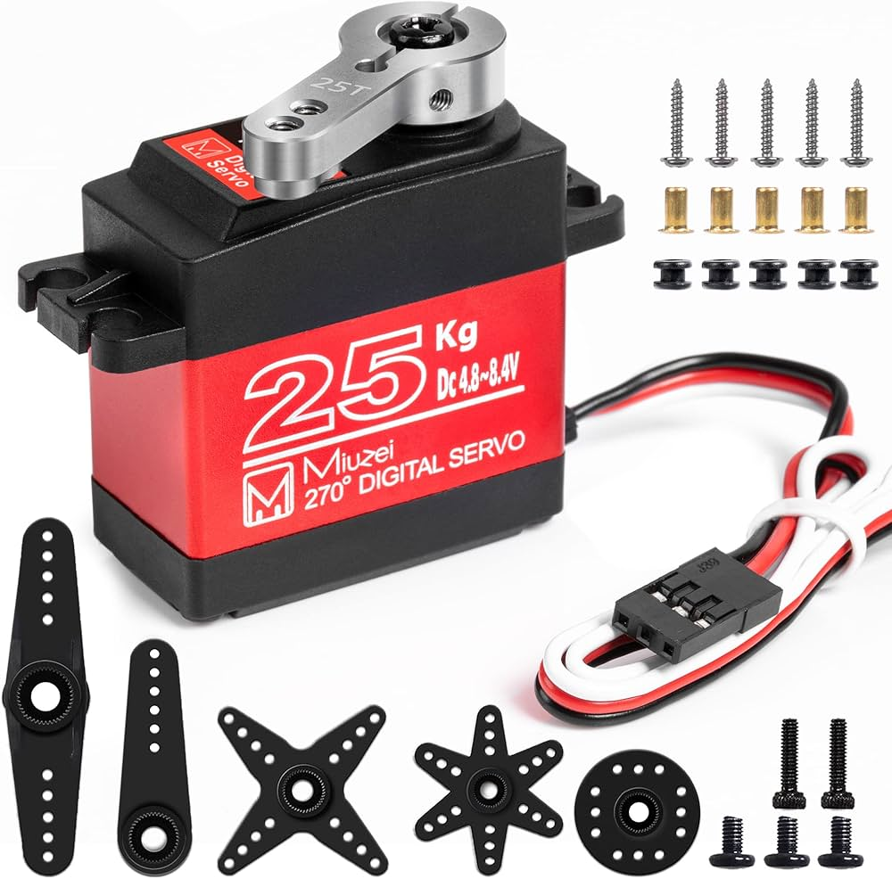
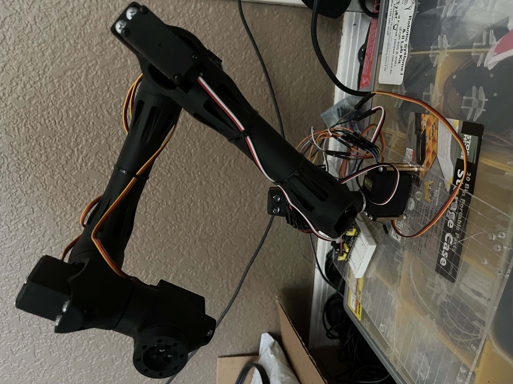
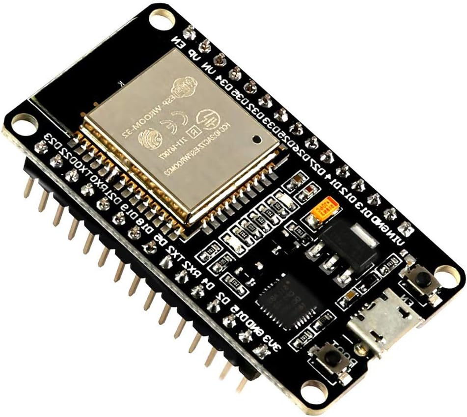

## Servos 1, 4-6

[Link](https://www.amazon.com/180°Metal-Waterproof-Airplane-Helicopter-Mechanical/dp/B09JWK2GB3?source=ps-sl-shoppingads-lpcontext&ref_=fplfs&smid=A2QTZX14X1D97I&gQT=2&th=1)

### MG995

This servo is used for the wrist joints on the arm and for the base servo. These are what we used throughout the class so the familiarity with them was the main reason for using them in addition to the ability to add the horns on them for much more secure fittings to the frame and joint end effectors.

## Servos 2,3

[Link](https://www.amazon.com/dp/B0C5LTKBD4?ref_=pe_123509780_1038749300_i_fed_asin_title&th=1)

### MS62

For the shoulder joints I learned they needed a much higher torque rated servo to handle the heavy wrist I put on the end of it. The addition 90 degrees of motion that they provide over the other 180 degree servos greatly increase the range of motion.

## Structure

[Link](https://makerworld.com/en/models/1179355-6dof-robot-arm-modular-cheap-educational?from=search)

### 3D model

The main model of the arm is a 3D model I found and made some minor adjustments to after running into a few major problems. The joint attachments were not very secure as they mainly relied on just one attachment to the center of the servo.

### Joint redesign

* [Part STL File](Part6.STL)

To keep the join connections from stripping under any kind of load I redesigned them to be compatible with the horns by adding 4 additional holes in them for the screws. In addition to widening the connecting end to account for the extra holes. All the parts were 3D printed using PLA.

## Microchip

[Link](https://www.amazon.com/ESP-WROOM-32-Development-Dual-Mode-Microcontroller-Integrated/dp/B07WCG1PLV/ref=asc_df_B07WCG1PLV?mcid=9cadef0f9b7a3539a6e364cd9e2dd051&hvocijid=5133585685668192366-B07WCG1PLV-&hvexpln=73&tag=hyprod-20&linkCode=df0&hvadid=721245378154&hvpos=&hvnetw=g&hvrand=5133585685668192366&hvpone=&hvptwo=&hvqmt=&hvdev=c&hvdvcmdl=&hvlocint=&hvlocphy=9061142&hvtargid=pla-2281435178538&th=1)

### ESP32

I was originally planning on using a PIC but unfortunately C is unable to do complex matrix math so I needed a microcontroller that could run Python. Once I switched to Python I no longer needed to do the long matrix multiplication by hand for use in C allowing me to focus on the additional functionality of the arm like forward and inverse kinematics in addition to the Jacobian path-finding it needed.