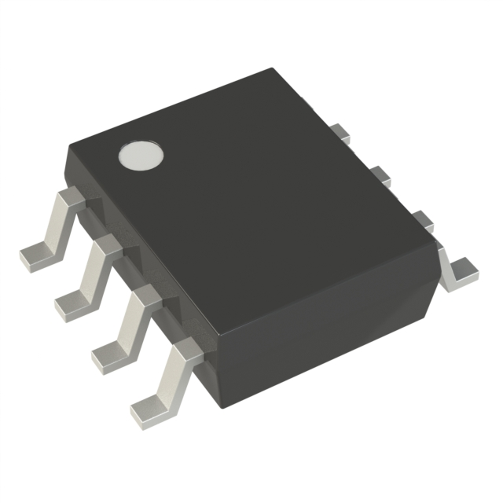
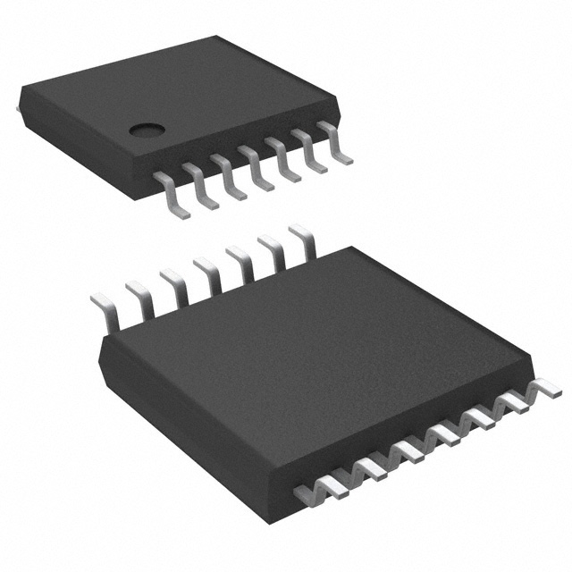

## Hall Effect Sensor

| Model | Pros | Cons |
| ----- | ------------ | ------------ |
| AS5600-ASOM $4.54 [Link](https://www.digikey.com/en/products/detail/ams-osram/AS5600-ASOM/4914332)    | <ul><li>Used in Class</li><li>Programmable angle change</li><li>Uses I2C Communication</li><li>3.3V Operating Voltage</li></ul> | <ul><li>Arduino Library</li><li>Cheap</li></ul> |
| MLX90316KDC $5.52 [Link](https://www.digikey.com/en/products/detail/melexis-technologies-nv/MLX90316KDC-BDG-100-RE/2242692)    | <ul><li>Tri Axis Measurement</li><li>Uses I2C Communication</li></ul> | <ul><li>4.5-5.5V Operating Voltage</li><li>Library for Arduino</li><li>Much more expensive</li></ul> |
| AS5048B $7.46 [Link](https://www.digikey.com/en/products/detail/ams-osram-usa-inc/AS5048B-HTSP-500/3188616)    | <ul><li>0.05 Degree Measurement</li><li>Uses I2C Communication</li><li>3.3V Operating Voltage</li></ul> | <ul><li>Few Extra Pins</li><li>No Library</li><li>Much more expensive</li></ul> |

### Selected Component
**Choice:** Option 1: AS5600
**Rationale:** The reason for choosing this Hall Effect sensor is due to the familiarity of use. In addition, as we are just using it as a way to measure motor rotational speed we do not need one as accurate or expensive in favor of a less accurate cheaper option. The lack of a usable library means more digging into the data sheet for needed information but the Arduino libraries can help with example code.

## Simple Needed Components

| Component | Specs |
| --------- | ----- |
| Resistor | <ul><li>10k [Link](https://www.digikey.com/en/products/detail/stackpole-electronics-inc/RMCF2010FT10K0/1758376)</li><li>330 [Link](https://www.digikey.com/en/products/detail/stackpole-electronics-inc/RMCF2010JT1K20/1757109)</li><ul> |
| Capacitor | <ul><li>100nF [Link](https://www.digikey.com/en/products/detail/yageo/CC0805KRX7R9BB104/302874)<li><ul> |
| Diode | <ul><li>600mV @ 1A [Link](https://www.digikey.com/en/products/detail/micro-commercial-co/B5819WS-TP/2213555)</li><ul> |
| Inductor | <ul><li>220uH [Link](https://www.digikey.com/en/products/detail/bourns-inc/CM453232-221KL/1970080)</li><ul> |
| Switching Regulator | <ul><li>3.3V [Link](https://www.digikey.com/en/products/detail/onsemi/LM2575D2T-3-3R4G/1476688)</li><ul> |
| Simple AC Motor  ***Non-Driven, position measured*** | [Link](https://www.digikey.com/en/products/detail/sparkfun-electronics/ROB-11696/6163657?gclsrc=aw.ds&&utm_adgroup=&utm_source=google&utm_medium=cpc&utm_campaign=PMax%20Shopping_Product_Low%20ROAS%20Categories&utm_term=&utm_content=&utm_id=go_cmp-20243063506_adg-_ad-__dev-c_ext-_prd-6163657_sig-CjwKCAiA2JG9BhAuEiwAH_zf3oq15u6VnL4cq87XFDrNdmTuq9TBOPO5mJv7fST6NklMeJz0bCmOzxoCzhsQAvD_BwE&gad_source=1&gclid=CjwKCAiA2JG9BhAuEiwAH_zf3oq15u6VnL4cq87XFDrNdmTuq9TBOPO5mJv7fST6NklMeJz0bCmOzxoCzhsQAvD_BwE&gclsrc=aw.ds) |