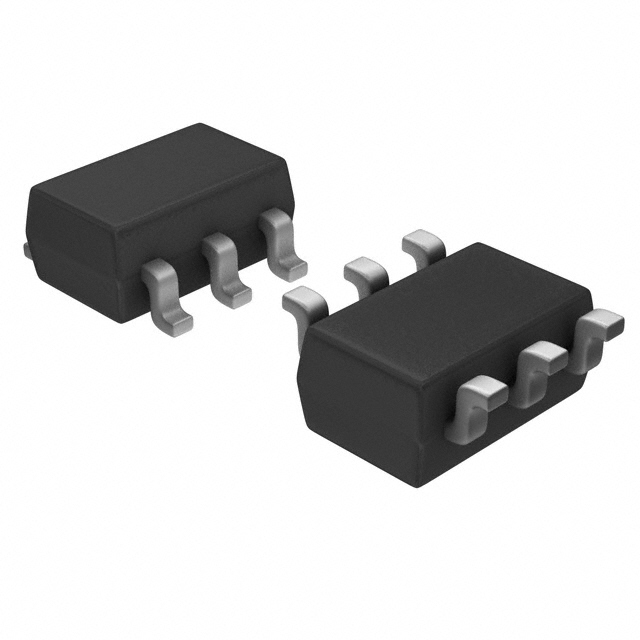
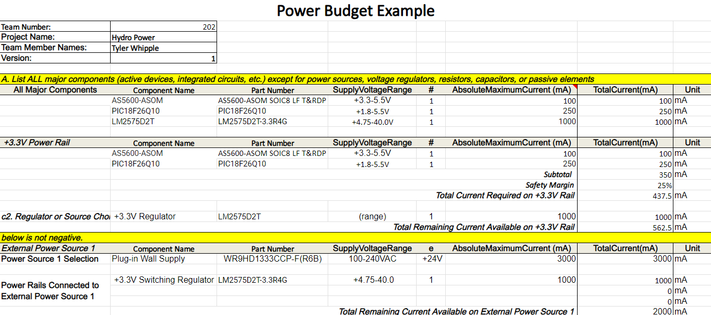

## Hall Effect Sensor

| Model | Pros | Cons |
| ----- | ------------ | ------------ |
| AS5600-ASOM $4.54 [Link](https://www.digikey.com/en/products/detail/ams-osram/AS5600-ASOM/4914332)    | <ul><li>Used in Class</li><li>Programmable angle change</li><li>Uses I2C Communication</li><li>3.3V Operating Voltage</li></ul> | <ul><li>Arduino Library</li><li>Cheap</li></ul> |
| MLX90316KDC $5.52 [Link](https://www.digikey.com/en/products/detail/melexis-technologies-nv/MLX90316KDC-BDG-100-RE/2242692)    | <ul><li>Tri Axis Measurement</li><li>Uses I2C Communication</li></ul> | <ul><li>4.5-5.5V Operating Voltage</li><li>Library for Arduino</li><li>Much more expensive</li></ul> |
| AS5048B $7.46 [Link](https://www.digikey.com/en/products/detail/ams-osram-usa-inc/AS5048B-HTSP-500/3188616)    | <ul><li>0.05 Degree Measurement</li><li>Uses I2C Communication</li><li>3.3V Operating Voltage</li></ul> | <ul><li>Few Extra Pins</li><li>No Library</li><li>Much more expensive</li></ul> |

### Selected Component
**Choice:** Option 1: AS5600 
**Rationale:** The reason for choosing this Hall Effect sensor is due to the familiarity of use. In addition, as we are just using it as a way to measure motor rotational speed we do not need one as accurate or expensive in favor of a less accurate cheaper option. The lack of a usable library means more digging into the data sheet for needed information but the Arduino libraries can help with example code.

## Switching Regulator

| Model | Pros | Cons |
| ----- | ------------ | ------------ |
| LM2575D2T $3.32 [Link](https://www.digikey.com/en/products/detail/onsemi/LM2575D2T-3-3R4G/1476688)    | <ul><li>Used in Class</li><li>Few extra components</li><li>3.3V Output Voltage</li></ul> | <ul><li>1A current output</li><li>Expensive</li></ul> |
| TLV61046ADBVR $1.09 [Link](https://www.digikey.com/en/products/detail/texas-instruments/TLV61046ADBVR/8133008)    | <ul><li>Cheap</li><li>Few extra components</li><li>3.3V output</li></ul> | <ul><li>5.5V Max input</li><li>1A current output</li></ul> |
| AP63203WU-7 $1.38 [Link](https://www.digikey.com/en/products/detail/diodes-incorporated/AP63203WU-7/9858426)    | <ul><li>Cheap</li><li>2A current output</li><li>3.3V output</li></ul> | <ul><li>lots of extra components</li><li>fast switching frequency making more noise</li></ul> |

### Selected Component
**Choice:** Option 1: LM2575D2T 
**Rationale:** The reason for choosing this switching regulator is due to the low amount of external components and constant 1A current output as the rest of the system does not need more than ""mA.

## Simple Needed Components

| Component | Specs |
| --------- | ----- |
| Resistor | <ul><li>10k [Link](https://www.digikey.com/en/products/detail/stackpole-electronics-inc/RMCF2010FT10K0/1758376)</li><li>31k [Link](https://www.digikey.com/en/products/detail/stackpole-electronics-inc/RNCP1206FTD1K00/2240337)</li><li>330 [Link](https://www.digikey.com/en/products/detail/stackpole-electronics-inc/RMCF2010JT1K20/1757109)</li><ul> |
| Capacitor | <ul><li>100nF [Link](https://www.digikey.com/en/products/detail/yageo/CC0805KRX7R9BB104/302874)</li><li>100uF [Link](https://www.digikey.com/en/products/detail/murata-electronics/GRM31CD80J107MEA8K/13905021)</li><li>330uF [Link](https://www.digikey.com/en/products/detail/murata-electronics/GRM32ER60G337ME05L/6155746)</li><ul> |
| Diode | <ul><li>600mV @ 1A [Link](https://www.digikey.com/en/products/detail/micro-commercial-co/B5819WS-TP/2213555)</li><ul> |
| Inductor | <ul><li>220uH [Link](https://www.digikey.com/en/products/detail/bourns-inc/CM453232-221KL/1970080)</li><ul> |
| LED | <ul><li>150mA [Link](https://www.digikey.com/en/products/detail/ams-osram-usa-inc/GT-JTLPS1-13-KKLN-25-1-150-R33/16820475)</li><ul> |
| Fuse | <ul><li>500mA Ih/ 1A It [Link](https://www.digikey.com/en/products/detail/bel-fuse-inc/0ZCG0050AF2C/4156100)</li><li>100mA Ih/ 250mA It [Link](https://www.digikey.com/en/products/detail/bel-fuse-inc/0ZCH0010FF2E/4156118)</li><ul> |
| Simple AC Motor  ***Non-Driven, position measured by sensor*** | [Link](https://www.digikey.com/en/products/detail/sparkfun-electronics/ROB-11696/6163657?gclsrc=aw.ds&&utm_adgroup=&utm_source=google&utm_medium=cpc&utm_campaign=PMax%20Shopping_Product_Low%20ROAS%20Categories&utm_term=&utm_content=&utm_id=go_cmp-20243063506_adg-_ad-__dev-c_ext-_prd-6163657_sig-CjwKCAiA2JG9BhAuEiwAH_zf3oq15u6VnL4cq87XFDrNdmTuq9TBOPO5mJv7fST6NklMeJz0bCmOzxoCzhsQAvD_BwE&gad_source=1&gclid=CjwKCAiA2JG9BhAuEiwAH_zf3oq15u6VnL4cq87XFDrNdmTuq9TBOPO5mJv7fST6NklMeJz0bCmOzxoCzhsQAvD_BwE&gclsrc=aw.ds) |

## Power Budget

