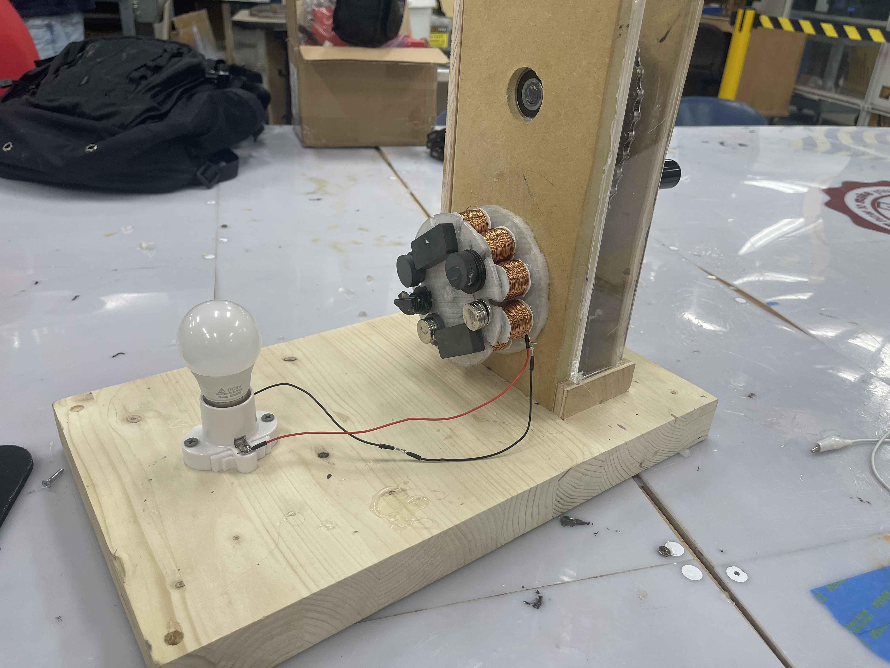

## Project Description

The purpose of the project was to make an interactive STEM display for a teachers classroom. The teacher we were paired up with wanted a display that could show the interaction between magnetism and electricity for her 2nd grade class. We ended up deciding on a hand powered AC generator that the kids could use to light up a lightbulb. The additional features we included outside of the main components being the generator itself is that for safety there is a slip gear built into the hand crank so that when the kids would spin it they would not get hurt from the handle spinning wildly but instead it would stop and let the chain keep spinning.
