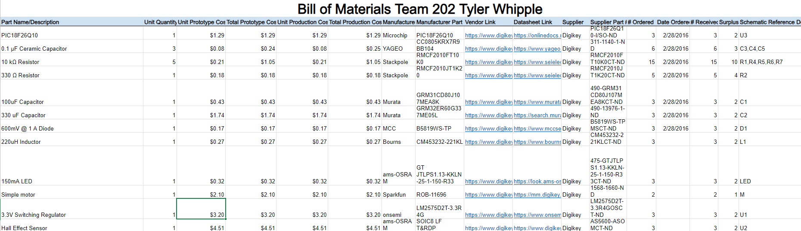

## Schematic

### Schematic Design

The main functionality of this board is reading the hall effect sensor, processing the information, and sending it to the rest of the team. The sensor communicates via I2C so all lines utilizing that communication have pull up resistors to help reset them. The switching regulator provides a constant 3.3V to the whole board which all components need to operate. It gets the main power either from the barrel jack or from the team via the header which can be swapped to via the jumper. The ICSP is there to make changes to code as needed if any bugs or problems arise. Since the board only needed to read in the sensor and send and receive information, the design was kept rather simplistic to reduce the cost and amount of trouble points where things could go wrong.

* [Schemtaic Folder](WhippleScehmatic.zip)

## PCB

* [PCB Folder](WhippleEGR314SoloBoard.zip)

## Assembled Board

## Version 2.0

Most of the improvements I would make to the board would be mainly spacing issues on the PCB layout. The placement of my ICSP pins had an annoying issue where I could not have it plugged in while the 8-pin ribbon cable was plugged in. Aside from that, adding some more GPIO pins the can be used and added to if need be would have helped, both for debugging purposes and for future use of the board if I wanted to expand the functionality of it. Other than that there really is no changes I would have made to the design or board. Everything worked as soon as it was connected to the board and there was no issue coding or testing all the functionality of it.