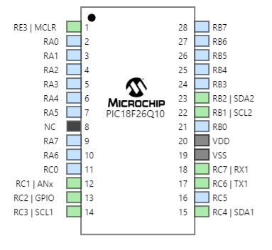

| Pic Info                                      | Answer |
| --------------------------------------------- | ------ |
| Model                                         | PIC18F26Q10      |
| Product Page URL                              | [Product](https://www.microchip.com/en-us/product/PIC18F26Q10)      |
| Datasheet URL(s)                              | [DataSheet](https://onlinedocs.microchip.com/oxy/GUID-3DE2FD80-B947-470A-90C6-17D8D16DED66-en-US-14/index.html)      |
| Application Notes URL(s)                      | [HLVD](https://www.microchip.com/en-us/application-notes/tb3237) [DAC](https://www.microchip.com/en-us/application-notes/tb3238) [ADCC](https://www.microchip.com/en-us/application-notes/tb3263) [Coding](https://www.microchip.com/en-us/application-notes/tb3261)    |
| Vendor link                                   | [Digikey]([#](https://www.digikey.com/en/products/detail/microchip-technology/PIC18F26Q10-I-SO/9996528))      |
| Example Code                                  | [Code](https://github.com/microchip-pic-avr-examples/pic18f47Q10-curiosity-hpc-demo-code) |
| Unit cost                                     | $1.29      |
| Absolute Maximum Current for entire IC        | 250mA      |
| Supply Voltage Range                          | 1.8-5.5V      |
| Maximum GPIO current   (per pin)           | 50mA      |
| Supports External Interrupts?                 | 3 Total      |
| Required Programming Hardware, Cost, URL      | [Snap](https://www.microchip.com/en-us/development-tool/PG164100)      |
| Works with MPLabX?                            | Yes      |
| Works with Microchip Code Configurator?       | Yes      |

| Module | # Available | Needed | Associated Pins (or * for any) |
| ---------- | ----------- | ------ | ------------------------------ |
| GPIO       | 26           | 0      | *                              |
| ADC        | 16           | 1      | 2-18                              |
| UART       | 1           | 1      | 17-18/27-28                              |
| SPI        | 2           | 0      | 14-15/22-23                              |
| I2C        | 2           | 2      | 14-15/22-23                             |
| PWM        | 2           | 0      | 2-18                              |
| ICSP       | 1           | 1      | 3                              |

