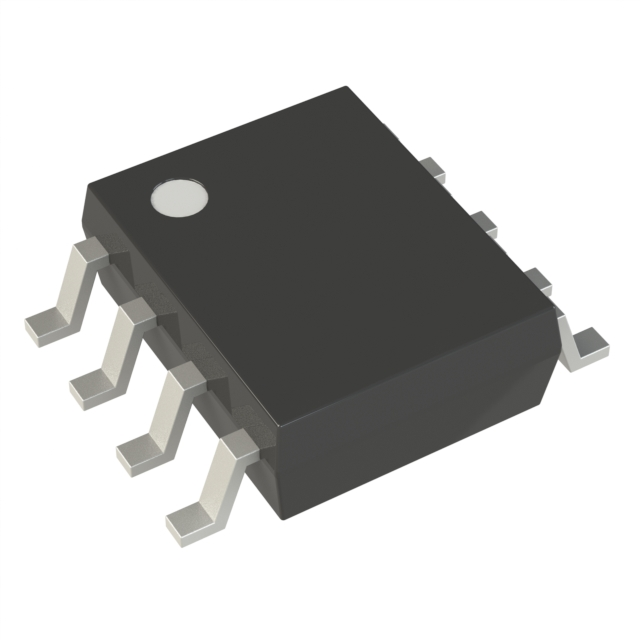

## Hall Effect Sensor

| Model | Pros | Cons |
| ----- | ------------ | ------------ |
| AS5600-ASOM [Link](https://www.digikey.com/en/products/detail/ams-osram/AS5600-ASOM/4914332)    | <ul><li>Used in Class</li><li>Programmable angle change</li><li>Uses I2C Communication</li><li>3.3V Operating Voltage</li></ul> | <ul><li>Arduino Library</li>li>Cheap</li></ul> |
| MLX90316KDC [Link](https://www.digikey.com/en/products/detail/melexis-technologies-nv/MLX90316KDC-BDG-100-RE/2242692)    | <ul><li>Tri Axis Measurement</li><li>Uses I2C Communication</li></ul> | <ul><li>4.5-5.5V Operating Voltage</li><li>Library for Arduino</li><li>Much more expensive</li></ul> |
| AS5048B [Link](https://www.digikey.com/en/products/detail/ams-osram-usa-inc/AS5048B-HTSP-500/3188616)    | <ul><li>0.05 Degree Measurement</li><li>Uses I2C Communication</li><li>3.3V Operating Voltage</li></ul> | <ul><li>Few Extra Pins</li><li>No Library</li><li>Much more expensive</li></ul> |